<h2><code>felipe@github:~$ whoami</code></h2>

 
 

<h3><code>felipe@github:~$ ./stack.sh</code></h3>

 

<h3><code>felipe@github:~$ ./contributions.sh</code></h3>

 
 

 
 

Transformando regras de negócio em soluções simples, organizadas e fáceis de manter.

